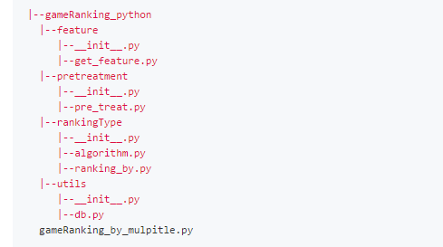
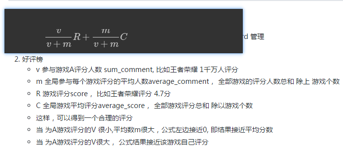
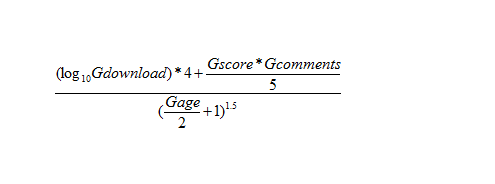

#### gameRanking_python 

1. python 项目结构
  - 
  - utils 一些固定操作如，数据库读写操作 db.py
  - pretreatment 预处理函数，如去除标点符号、时间戳转换等
  - feature  数据集特征提取，如game 下载量、评分人数、发行时间等指标
  - rankingType  多个排行函数，得到不同的排行榜
      - algorithm  多种计算算法
  - gameRanking_by_mulpitle.py 
     - 将多个指标 merge 到一个数据集df
     - 调用 排行函数，得到多个排行榜
2. 排行思路
  - 下载榜
      - 将各个渠道游戏下载量相加，进行排行
  - 热门榜
      - 将各渠道游戏评分人数相加，进行排行
  - 新游榜
      - 参考各游戏最近的评论时间为游戏发行时间
      - 再结合 下载量 进行排行
  - 好评榜
      - 指标，各游戏评分score, 评分总人数total，每个游戏平均评分，平均评分人数
      - 参考 贝叶斯平均score , 得到游戏好评的平均程度，进行排行
  - 综合热度榜
      - 指标，game下载量、评分、评分人数、发行时间
      - 参考程序员问答网站对 问题的热度计算，进行排行
3. 相关算法
  - 贝叶斯平均
  - 
  - 热度计算公式 
  - 
    - 参考程序员问答网站对 问题的热度计算
    - Gdownlaod 游戏下载量，不能为0
    - Gscore 游戏评分，Gcomments 游戏评分人数
    - Gage 游戏发行距今小时数
    - 计算游戏热度个公式，考虑了时间因素

